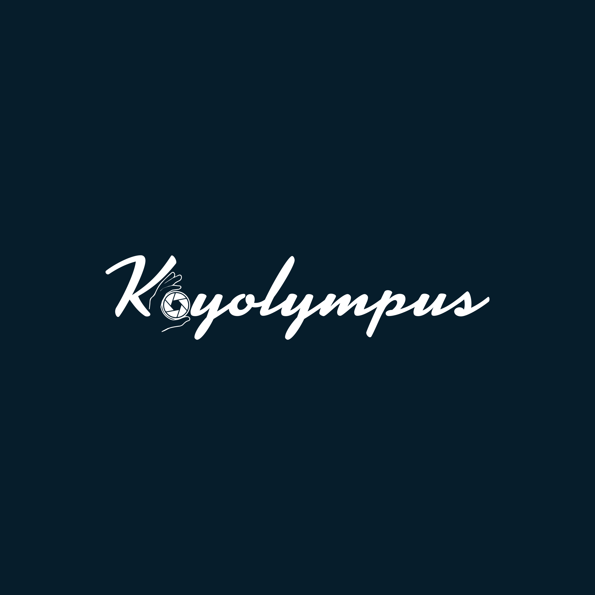

  

<h1 align="center">Koyolympus</h1>

  
  

  

  
  

  
## Overview
I am a Hobbyist Photographer in Japan. 
Therefore, this repository is for the website of my photographs.

## My Website

### [Are you ready to explore? Here is my website. Enjoy :crossed_fingers:](https://koyolympus.gallery/)

## Supported Browsers

  
  
  

## Languages and Tools

  
  
  
  
  

  
  
  
  
    

## Request

**I would be grateful if you could make issues and give opinions through github or my website** 
**whenever you found some security issues and vulnerability of the website.**
